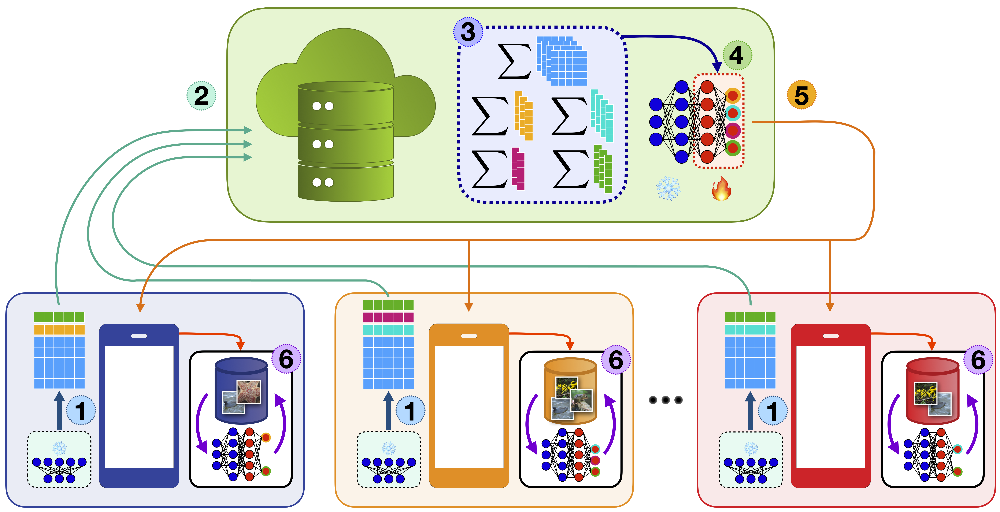

# Fed3R and OLL
Official implementation of the Federated Recursive Ridge Regression (**Fed3R**) and Only Local Labels (**OLL**) algorithms proposed in the ICML24 accepted paper "[Accelerating Heterogeneous Federated Learning with Closed-form Classifiers](https://arxiv.org/pdf/2406.01116)" and extended in the IEEE Access paper "[Resource-Efficient Personalization in Federated Learning with Closed-Form Classifiers](https://ieeexplore.ieee.org/stamp/stamp.jsp?arnumber=10946159)".



## How to cite

```
@article{fani2024accelerating,
    title={Accelerating heterogeneous federated learning with closed-form classifiers},
    author={Fanì, Eros and Camoriano, Raffaello and Caputo, Barbara and Ciccone, Marco},
    journal={Forty-first International Conference on Machine Learning (ICML)},
    year={2024}
}

@article{fani2025resource,
    title={Resource-Efficient Personalization in Federated Learning with Closed-Form Classifiers},
    author=Fanì, Eros and Camoriano, Raffaello and Caputo, Barbara and Ciccone, Marco},
    journal={IEEE Access},
    year={2025},
    publisher={IEEE}
}
```

## How to run

### Classifier initialization (Phase 1)

```
python src/fed3r.py configs/<config_file>
```

### Federated Fine-Tuning (Phase 2), Partial Personalization (Phase 3)

```
python src/train_pfl.py configs/<config_file>
```

### Full Personalization (Phase 4)

```
python src/train_finetune.py configs/<config_file>
```

----

The code of this repository is based on [this repository](https://github.com/facebookresearch/FL_partial_personalization).